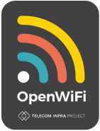

    

# OpenWifi User Self-Care portal (OWSUB)

## What is it?
The OWSUB is a service for the TIP OpenWiFi CloudSDK (OWSDK).
OWSUB provides a subscriber management service to the Subscriber App and interacts with the rest of the Cloud SDK. OWSUB, 
like all other OWSDK microservices, is defined using an OpenAPI definition and uses the ucentral communication 
protocol to interact with Access Points. To use the OWSUB, you either need to [build it](#building) or use the 
[Docker version](#docker).

## OpenAPI
The OWSUB-REST-API is defined in [openapi/userportal.yaml](https://github.com/routerarchitects/ra-wlan-cloud-userportal/blob/main/openapi/userportal.yaml) . You can use this OpenAPI definition to generate static API documentation, inspect the available endpoints, or build client SDKs.

## Building
To build the microservice from source, please follow the instructions in [here](./BUILDING.md)

## Docker
To use the CLoudSDK deployment please follow [here](https://github.com/routerarchitects/mango-cloud-deployment)

## Firewall Considerations
| Port  | Description                                 | Configurable |
|:------|:--------------------------------------------|:------------:|
| 16006 | Default port for REST API Access to the OWSUB |     yes      |

### OWSUB Service Configuration
The configuration is kept in a file called `owsub.properties`. To understand the content of this file,
please look [here](https://github.com/routerarchitects/ra-wlan-cloud-userportal/blob/main/CONFIGURATION.md)

## Kafka topics
Toe read more about Kafka, follow the [document](https://github.com/Telecominfraproject/wlan-cloud-ucentralgw/blob/main/KAFKA.md)
